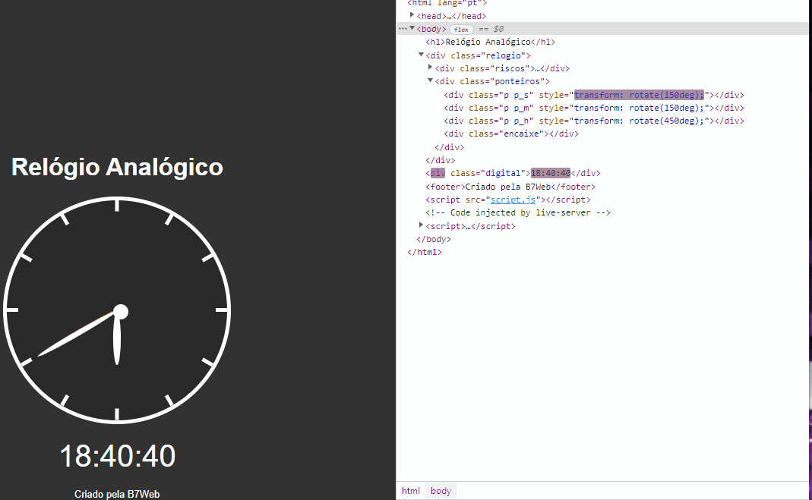

<h1 align="center">Projeto Relógio Analógico!🥁<h1/>

<h4>Projeto disponibilizado pela plataforma B7Web👨🏽‍💻<h4/>
<h4>✅ Projeto Finalizado ✅<h4/>
 <h5> 🚧 Porém aceita sugestões de melhorias 🚧 <h5/>
####
#####

  

<h3>Sumário</h3>
<a href="#sobre">Sobre</a>
<a href="#tecnologias">Tecnologias</a>
<a href="#funcionalidades">Funcionalidades</a>
<a href="#gif">GIF</a>

<h3 align="center" id="sobre">Sobre</h3>

Esse projeto trata-se de um exercício da do curso de JavaScript da plataforma B7Web,
com intuito de fortalecer os conceitos e práticas aprendidas durante o curso. O mesmo mesclas 
front-end com práticas de lógica de programação.

<h3 align="center" id="tecnologias">Tecnologias</h3>

Como se trata de um projeto simples, foi usado a tríade do desenvolvimento web básica HTML,CSS e JS. Não é preciso se aprofundar nas funconalidades de cada tecnologia. mas importante salientar HTML para estruturade marcação, CSS para estilos e customização e JS para aplicação de lógicas de programação.

<h3 align="center" id="funcionalidades">Funcionalidades</h3>

[✔] Design Simples
 
 
[✔] Automátização da update das horas;
 
 
[✔] Sincronismo entre os ponteiro e o reloógio digital
 

<h3 align="center" id="gif">GIF de usablidade</h3>

</img>

<h3 align="center">Muito Obrigado pela atenção🤝🏼</h3>